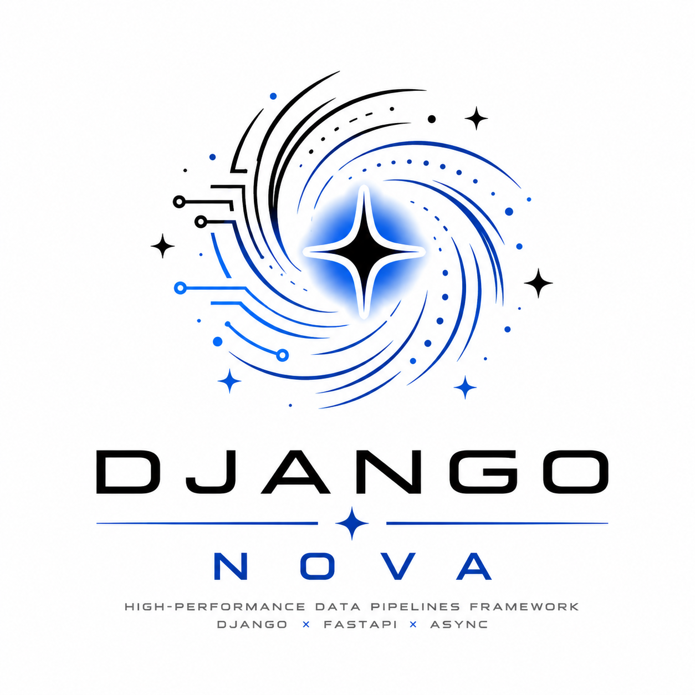

<div align="center">



# ⚡ Django Nova

**Typed, unified, and async-first toolkit for Django 5+**

*Eliminate architectural fragmentation. One schema. One truth. Zero duplication.*

[](https://pypi.org/project/django-nova/)
[](https://www.python.org/)
[](https://www.djangoproject.com/)
[](LICENSE)
[](https://github.com/microsoft/pyright)
[](https://djangopackages.org/packages/p/django_nova/)

[English](#english) | [Русский](#русский)

</div>

---

<a id="english"></a>

## 📋 Table of Contents

- [Problem Statement](#problem-statement)
- [Philosophy](#philosophy)
- [Architecture](#architecture)
- [Installation](#installation)
- [Quick Start](#quick-start)
- [🛡️ Validation Boundary](#%EF%B8%8F-validation-boundary)
- [Schema Compiler (DRF & Admin)](#schema-compiler-drf--admin)
- [Smart Query Planner](#smart-query-planner)
- [Distributed Context & Observability](#distributed-context--observability)
- [Infrastructure (Redis & Replicas)](#infrastructure-redis--replicas)
- [Smart Cache](#smart-cache)
- [Zero-Downtime Migrations](#zero-downtime-migrations)
- [Benchmarks](#benchmarks)
- [Roadmap](#roadmap)
- [License](#license)

---

## 🎯 Problem Statement

Django's validation layer is fragmented by design:

- **Forms** validate user input in the presentation layer.
- **DRF Serializers** re-implement the same logic in the API layer.
- **Model `clean()`** runs only inside the admin or when explicitly called.
- **Database constraints** are limited to simple, DB-expressible rules and are not reusable outside the ORM.

The result is **validation drift**: business rules scattered across forms, serializers, models, and database DDL. Change a rule in one place, and the other three become liabilities. Worse, calling `Model.objects.create()` from a management command, a Celery task, or a data pipeline bypasses form and serializer validation entirely, leaving only brittle DB constraints as a safety net.

**Django Nova solves this by moving the contract to the schema and enforcing it at the ORM level.**

---

## 🧠 Philosophy

| # | Principle | Description |
|---|-----------|-------------|
| 1 | **Schema is the Single Source of Truth** | Business logic lives in Pydantic models. Django Models, DRF Serializers, FastAPI routers, and Forms are generated projections of that schema — not independent validators. |
| 2 | **Validation is an ORM concern** | A model should refuse to persist invalid data regardless of whether the caller is a web view, an API endpoint, a CLI command, or a background worker. |
| 3 | **Infrastructure must be transparent** | Cache invalidation, structured logging, and distributed tracing should require zero boilerplate. If you have to think about them, the abstraction has leaked. |
| 4 | **Zero-downtime is the default** | Operations on large tables must use native PostgreSQL `CONCURRENTLY` semantics. Scheduled maintenance windows are an anti-pattern. |
| 5 | **Type safety is not optional** | Full `pyright --strict` compatibility across ORM, QuerySets, and generated code. If it type-checks, it runs. |

---

## 🏗️ Architecture

```text
┌─────────────────────────────────────────────────────────────────────────────┐
│                           Consumer Layers                                   │
│  ┌──────────┐  ┌──────────────┐  ┌─────────────┐  ┌─────────────────────┐  │
│  │  Forms   │  │ DRF Serial.  │  │ FastAPI     │  │ Management          │  │
│  │          │  │              │  │ Router      │  │ Commands            │  │
│  └────┬─────┘  └──────┬───────┘  └──────┬──────┘  └──────────┬──────────┘  │
│       │               │                 │                    │             │
│       └───────────────┴─────────────────┴────────────────────┘             │
│                           │                                                │
│              ┌────────────▼────────────┐                                   │
│              │   Pydantic Schema       │  ← Single Source of Truth         │
│              │      (Business)         │                                   │
│              └────────────┬────────────┘                                   │
│                           │                                                │
│              ┌────────────▼────────────┐                                   │
│              │      NovaModel          │  ← ORM Enforcement Layer          │
│              │     (Interceptor)       │                                   │
│              └────────────┬────────────┘                                   │
│                           │                                                │
│       ┌───────────────────┼──────────────────┐                             │
│       │                   │                  │                             │
│  ┌────▼─────┐    ┌────────▼────────┐   ┌─────▼──────┐                      │
│  │  Cache   │    │     Signals     │   │ Telemetry  │                      │
│  │Invalid.  │    │ (post_save etc) │   │(OTel/Logs) │                      │
│  └──────────┘    └─────────────────┘   └────────────┘                      │
└─────────────────────────────────────────────────────────────────────────────┘
```

**Core Design Decisions:**

- **PEP 695 Generics** — `class Cache[T]:` syntax for modern type inference.
- **PEP 562 Lazy Imports** — Safe import paths that bypass `AppRegistryNotReady` during startup.
- **SQL Compiler Hook** — Deterministic cache-key generation from query AST, immune to Django version changes.
- **Signal-Driven Invalidation** — O(1) cache eviction on write without manual TTL management.

---

## 📊 Comparison

| Feature | Django Nova | Django Modern REST | Django Ninja | drf-pydantic |
|---------|:-----------:|:------------------:|:------------:|:------------:|
| **Primary Role** | ORM toolkit + ecosystem bridge | API framework | API framework (DRF alternative) | DRF Serializer bridge |
| **Validation Layer** | ORM `save()` | API controllers | API decorators | DRF Serializers |
| **ORM Enforcement** | ✅ Automatic | ❌ None | ❌ None | ❌ None |
| **Schema Flexibility** | Pydantic v2 only | Pydantic, msgspec, attrs, dataclasses, TypedDict | Pydantic v2 only | Pydantic v2 only |
| **Pydantic v2** | ✅ Yes | ✅ Yes (optional) | ✅ Yes | ✅ Yes |
| **Async Support** | ✅ Native async ORM | ✅ Native async (no sync_to_async) | ✅ Native async API | ❌ Sync only |
| **Free-threading Support** | ❌ Unknown | ✅ Tested | ❌ Unknown | ❌ Unknown |
| **DRF Serializer Gen** | ✅ `to_drf_serializer()` | ❌ No (replaces DRF) | ❌ No (replaces DRF) | ✅ `.drf_serializer` |
| **FastAPI Router Gen** | ✅ `NovaRouter()` | ❌ No | ❌ No | ❌ No |
| **Admin Form Gen** | ✅ `compile_admin()` | ❌ No | ❌ No | ❌ No |
| **OpenAPI Docs** | ✅ Via FastAPI bridge | ✅ Native 3.1/3.2 semantic | ✅ Native, automatic | ❌ No |
| **QuerySet Cache** | ✅ Signal-driven O(1) | ❌ No | ❌ No | ❌ No |
| **Read Replica Routing** | ✅ Lag-aware | ❌ No | ❌ No | ❌ No |
| **Distributed Locks** | ✅ Redis Lua | ❌ No | ❌ No | ❌ No |
| **Rate Limiting** | ✅ Sliding window | ✅ Different backend and algorithms | ⚠️ Via Ninja Extra | ❌ No |
| **Pub/Sub Cache Invalidation** | ✅ Async facade | ❌ No | ❌ No | ❌ No |
| **Zero-Downtime Migrations** | ✅ `CONCURRENTLY` | ❌ No | ❌ No | ❌ No |
| **Structured Logging** | ✅ Zero-config structlog | ❌ No | ❌ No | ❌ No |
| **OpenTelemetry Tracing** | ✅ Lifecycle spans | ❌ No | ❌ No | ❌ No |
| **Distributed Context** | ✅ `contextvars` bridge | ❌ No | ❌ No | ❌ No |
| **Auto Query Optimization** | ✅ Deep planner + field deferral | ❌ No | ❌ No | ❌ No |
| **Compiled Performance (mypyc)** | ❌ No | ✅ 4–10× speedup | ❌ No | ❌ No |
| **Content Negotiation** | ❌ No | ✅ JSON, msgpack, SSE, JSON Lines | ❌ No | ❌ No |
| **Type Safety** | `pyright --strict` end-to-end | `mypy` + `pyright` + `pyrefly` strict | Type hints + Pydantic (API layer) | Pydantic validation in DRF |
| **Performance Focus** | +1.187 µs per `save()` | 7,026 RPS async (fastest Django API) | Fast API layer (Pydantic v2 Rust) | Zero runtime overhead |
| **Django Version Support** | 5.0+ | 5.0+ | 2.1+ | 2.2+ |
| **Python Version Support** | 3.12+ | 3.11+ | 3.7+ | 3.7+ |

> **One-line distinction:** Django Modern REST is a **blazingly fast, pluggable API framework** (not bound to Pydantic). Django Ninja is a **FastAPI-style API framework inside Django**. drf-pydantic is a **bridge for DRF users who want Pydantic validation**. Django Nova is a **data integrity toolkit** that enforces validation at the ORM level and generates APIs as a side effect.

### Verified Facts

**Django Ninja**
- API framework inspired by FastAPI, built on top of Django.
- Validation in API decorators via Pydantic v2 Rust core.
- `ModelSchema` generates Pydantic schemas **from** Django models.
- 100+ companies in production, v1.6.

**drf-pydantic**
- Adds `.drf_serializer` attribute to Pydantic models.
- Translation Pydantic → DRF Serializer at class creation time (zero runtime overhead).
- Optional Pydantic validation via `drf_config`.
- Supports nested models, per-field config, custom serializers.

**Django Modern REST**
- API framework, not ORM toolkit.
- Pluggable schemas: Pydantic, msgspec, attrs, dataclasses, TypedDict.
- Fastest Django API framework: 7,026 RPS async (official benchmark).
- Compiled with mypyc: 4–10× speedup on hot paths.
- Content negotiation: JSON, msgpack, SSE, JSON Lines.
- OpenAPI 3.1/3.2 semantic generation.
- 100% test coverage, 2000+ tests.
- Team-backed (wemake-services), not single-person.
- Testimonials from CPython and Django core developers.

---

## 📦 Installation

Requires **Python 3.12+** and **Django 5.0+** (tested with Django 5.0, 5.1, 5.2).

Using [`uv`](https://docs.astral.sh/uv/) (recommended):

```bash
# Core library
uv add django-nova

# With Django REST Framework support
uv add django-nova[drf]

# With Redis infrastructure & Distributed Locks
uv add django-nova[redis]
# or
uv add django-nova[cache]

# With OpenTelemetry tracing
uv add django-nova[tracing]

# Full enterprise stack (tracing + observability)
uv add django-nova[tracing,observability]

# With FastAPI integration
uv add django-nova[fastapi]

# With async task queue
uv add django-nova[tasks]

# With async database support
uv add django-nova[async]
```

### Add to `INSTALLED_APPS`:

```python
INSTALLED_APPS = [
    # ...
    "nova",
]
```

---

## 🚀 Quick Start

Define your business rules once in a Pydantic schema. Nova enforces them everywhere.

```python
# models.py
from decimal import Decimal
from datetime import date
from pydantic import BaseModel, field_validator, model_validator
from django.db import models
from nova import NovaModel, NovaConfig


class GrantSchema(BaseModel):
    """Single Source of Truth for Grant business rules."""

    title: str
    budget: Decimal
    start_date: date
    end_date: date
    pi_email: str  # Principal Investigator

    @field_validator("title")
    @classmethod
    def title_not_empty(cls, v: str) -> str:
        v = v.strip()
        if len(v) < 5:
            raise ValueError("Title must be at least 5 characters")
        return v

    @model_validator(mode="after")
    def validate_grant(self):
        if self.end_date <= self.start_date:
            raise ValueError("End date must be after start date")
        return self


class Grant(NovaModel):
    title = models.CharField(max_length=300)
    budget = models.DecimalField(max_digits=14, decimal_places=2)
    start_date = models.DateField()
    end_date = models.DateField()
    pi_email = models.EmailField()

    _nova_config = NovaConfig(
        pydantic_schema=GrantSchema,
        cache_enabled=True,
        strict_validation=True,
    )
```

Now validation is enforced at the ORM level:

```python
# This raises ValidationError immediately — no DB round-trip required
Grant.objects.create(
    title="X",
    budget=Decimal("500"),
    start_date=date(2026, 1, 1),
    end_date=date(2026, 12, 31),
    pi_email="pi@example.com",
)
# ValueError: Title must be at least 5 characters
```

---

## 🛡️ Validation Boundary

Django Nova enforces the Pydantic contract strictly at the `Model.save()` boundary.

### Validated Paths

Any code path that triggers `save()` will run the full Pydantic schema validation (including cross‑field validators) before touching the database.

```python
instance = Grant(start_date="2024-12-31", end_date="2024-01-01")
instance.save()  # ❌ Raises NovaValidationError (cross‑field invariant failed)

instance.save(update_fields=["start_date"])  # ❌ Still validates the FULL model
```

### Intentionally Unvalidated Paths (ORM Boundaries)

To maintain transparency and avoid "magic" overrides of Django's internal QuerySet mechanics, Nova does not intercept bulk or direct SQL operations.

If you use these methods, you are responsible for ensuring data integrity:

```python
# Bypasses NovaModel.save() → Bypasses Pydantic Validation
Grant.objects.filter(...).update(end_date="2024-01-01")
Grant.objects.bulk_create([...])
Grant.objects.bulk_update([...], ["end_date"])
```

**Architectural Decision:** We deliberately chose not to patch Django's internal QuerySet methods (like `bulk_create`) to force validation. Doing so would introduce hidden side‑effects, break QuerySet composition, and violate the principle of Transparent Infrastructure. If you need validation on bulk operations, validate your data before passing it to the QuerySet.

---

## 🔌 Schema Compiler (DRF & Admin)

Why write serializers and admin forms if the schema already knows the rules? Nova dynamically compiles them.

### DRF Integration

```python
# serializers.py
from nova.ecosystem import to_drf_serializer
from .models import Grant

# Dynamically generates a strict ModelSerializer bound to GrantSchema
GrantSerializer = to_drf_serializer(Grant)
```

> **Note:** The generated serializer strictly exposes **ONLY** fields defined in the Pydantic schema (+ PK). Sensitive DB fields not present in the schema are automatically hidden from the API.

### Django Admin Integration

```python
# admin.py
from django.contrib import admin
from nova.ecosystem import compile_admin
from .models import Grant

# Compiles an Admin class that intercepts Form validation via Pydantic
admin.site.register(Grant, compile_admin(Grant))
```

---

## 🧭 Smart Query Planner

Tell Nova what you need via the schema, and it optimizes the SQL for you.

```python
class ArticleSchema(BaseModel):
    title: str
    author: AuthorSchema    # Triggers select_related
    tags: list[TagSchema]   # Triggers prefetch_related


class Article(NovaModel):
    title = models.CharField(max_length=200)
    body = models.TextField()  # NOT in schema!
    author = models.ForeignKey(Author, on_delete=models.CASCADE)
    _nova_config = NovaConfig(pydantic_schema=ArticleSchema)
```

**Auto-Optimization:**

```python
qs = Article.objects.filter(title__icontains="django").auto()
```

Generates:

```sql
SELECT article.id, article.title, article.author_id
FROM article
INNER JOIN author ON article.author_id = author.id
WHERE article.title LIKE '%django%';
-- DEFERRED: article.body (because it's missing in ArticleSchema)
```

---

## 🔭 Distributed Context & Observability

Enterprise logging requires correlation. If a request hits a View, fails in the ORM, and retries in a Celery task, you need to link them.

```python
# In your Django Middleware
from nova.core import bind, clear


class CorrelationMiddleware:
    def __init__(self, get_response):
        self.get_response = get_response

    def __call__(self, request):
        request_id = request.headers.get("X-Request-ID", "unknown")
        bind(correlation_id=request_id, user_id=request.user.id)

        response = self.get_response(request)
        clear()  # Prevent context leaks
        return response
```

**Result:** Every structlog JSON log and every OpenTelemetry span automatically includes `correlation_id` and `user_id`. Zero boilerplate in your business logic.

---

## 🏭 Infrastructure (Redis & Replicas)

### Unified Redis Client

No more connection sprawl. Cache, Locks, and Tasks share a single process-wide pool.

```python
from nova.redis import get_redis_client, check_redis_health

client = get_redis_client()
health = check_redis_health()  # Returns RedisHealthReport(is_healthy=True, latency_ms=0.4)
```

### Lag-Aware Read Replicas

```python
# In settings.py
DATABASE_ROUTERS = ["nova.db.NovaDatabaseRouter"]

# In your code
qs = Article.objects.using_replica().all()
```

If the replica's replication lag exceeds `NOVA_REPLICA_MAX_LAG_MS` (default 500ms), Nova transparently falls back to the Master to prevent serving stale data. No developer intervention required.

### Distributed Locks

```python
from nova.redis import AsyncDistributedLock

async with AsyncDistributedLock("migration_key", timeout=10.0):
    # Safe to run concurrent tasks without race conditions
    await run_heavy_migration()
```

---

## 💾 Smart Cache

Nova provides an automatic, signal-driven QuerySet cache with O(1) invalidation.

```python
class Grant(NovaModel):
    # ... fields ...
    _nova_config = NovaConfig(
        pydantic_schema=GrantSchema,
        cache_enabled=True,
        cache_ttl_seconds=300,
    )
```

- **Deterministic keys** — Generated from the SQL AST.
- **No stale data** — Write operations trigger signal-based eviction.
- **Zero boilerplate** — No manual cache key management.

---

## 🔄 Zero-Downtime Migrations

For tables with millions of rows, standard `CREATE INDEX` acquires an exclusive lock. Nova provides migration operations that use PostgreSQL `CONCURRENTLY`.

```python
from nova.db import AddFieldConcurrently, CreateIndexConcurrently


class Migration(migrations.Migration):
    operations = [
        AddFieldConcurrently(
            model_name="grant",
            name="funding_program",
            field=models.CharField(max_length=100, default="NSF"),
        ),
        CreateIndexConcurrently(
            model_name="grant",
            fields=["start_date", "end_date"],
            name="grant_dates_idx",
        ),
    ]
```

---

## 📊 Benchmarks

All benchmarks measure model initialization speed (object creation + validation) on Python 3.13, local SSD, warm CPU, GC disabled.

```bash
$ uv run ruff check .
All checks passed!

$ uv run pytest -v
284 passed, 11 skipped in 3.89s

$ uv run python scripts/bench.py
Running 100,000 iterations (GC Disabled)...

==================================================
Pure Pydantic:     0.632 µs/iter
NovaModel (Full):  1.819 µs/iter
Overhead Ratio:    2.88x
Absolute Overhead: +1.187 µs
==================================================
```

| Test | Avg Time | Ops / Second | Overhead |
|------|----------|--------------|----------|
| Pure Pydantic (Baseline) | 0.632 µs | 1,582K | 1.0× |
| NovaModel (Full) | 1.819 µs | 550K | 2.88× |

> **Note:** The absolute penalty is only **1.187 microseconds** per object. You gain full ORM-level type safety, unified validation, deep tracing, cache abstraction, async query planning, distributed locks, rate limiting, and pub/sub — at the cost of a single microsecond.

Test suite: **284 passed, 11 skipped in 3.89s**. Zero lint errors. Full `pyright --strict` compatibility.

---

## 🗺️ Roadmap

### ✅ What is Built

| Category | Feature | Status | Notes |
|----------|---------|--------|-------|
| **Core Engine** | Typed ORM, Managers, QuerySets | ✅ Stable | Full `pyright --strict` compatibility |
| **Core Engine** | Pydantic Bridge & Unified Validation | ✅ Stable | Bidirectional sync, single source of truth |
| **Core Engine** | Full Async ORM Integration | ✅ Stable | Native `AsyncTypedQuerySet` with `.aauto()` planner |
| **Ecosystem** (Schema Compiler) | Auto DRF Serializer Generation | ✅ Stable | Strict projection, Pydantic validation injection |
| **Ecosystem** (Schema Compiler) | Auto Django Admin Generation | ✅ Stable | Dynamic Forms with Pydantic `clean()` hooks |
| **Ecosystem** (Schema Compiler) | Admin JSON UI Schema Generator | ✅ Stable | Extracts validation rules for Frontend |
| **Query Engine** | Deep Query Planner | ✅ Stable | Recursive graph traversal for JOINs |
| **Query Engine** | Auto Field Deferral | ✅ Stable | Omits DB columns not present in Pydantic schema |
| **Infrastructure** | Unified Redis Client & Pool | ✅ Stable | Sync/Async pools, health checks, zero sprawl |
| **Infrastructure** | Distributed Locks | ✅ Stable | Lua-scripted async locks for Zero-Downtime |
| **Infrastructure** | Distributed Rate Limiter | ✅ Stable | Atomic Sliding Window via Lua scripts |
| **Infrastructure** | Async Pub/Sub Facade | ✅ Stable | Real-time inter-process cache invalidation |
| **Infrastructure** | Lag-Aware Read Replica Router | ✅ Stable | Thread-safe local cache, automatic Master failover |
| **Infrastructure** | Zero-Downtime Migrations | ✅ Stable | `CONCURRENTLY` operations out of the box |
| **Observability** | OTEL Tracing & Structlog | ✅ Stable | Zero-config lifecycle spans |
| **Observability** | Distributed Context (Correlation IDs) | ✅ Stable | `contextvars` bridge to Logs & Traces |
| **Platform** | Stable Public API (Frozen) | ✅ Stable | PEP 562 Facades, Semver compliant |
| **Platform** | Django System Checks | ✅ Stable | Fail-fast infrastructure validation |
| **Platform** | GraphQL Schema Compiler (Strawberry) | ✅ Stable | The recursive compiler in Strawberry |

### 📊 Overall Progress

```text
████████████████████████████████████████ 100%  Core Features
████████████████████████████████████████ 100%  Infrastructure
████████████████████████████████████████ 100%  Production Readiness
```

**Current Phase:** 100% Enterprise Ready.

---

## 📄 License

MIT License. See [LICENSE](LICENSE) for details.

## 👤 Author

**Artem Alimpiev**

- ORCID: [0009-0007-6740-7242](https://orcid.org/0009-0007-6740-7242)
- DOI: [10.5281/zenodo.20057443](https://doi.org/10.5281/zenodo.20057443)
- DOI: [10.5281/zenodo.20659647](https://doi.org/10.5281/zenodo.20659647)
- PyPI: [Django Nova](https://pypi.org/project/django-nova/)

---
---

<a id="русский"></a>

<div align="center">


# ⚡ Django Nova

**Типизированный, унифицированный и async-first тулкит для Django 5+**

*Устраните архитектурную фрагментацию. Одна схема. Одна истина. Ноль дублирования.*

</div>

## 📋 Содержание

- [Постановка проблемы](#постановка-проблемы)
- [Философия](#философия)
- [Архитектура](#архитектура)
- [Установка](#установка)
- [Быстрый старт](#быстрый-старт)
- [🛡️ Граница валидации](#%EF%B8%8F-граница-валидации)
- [Компилятор схем (DRF & Admin)](#компилятор-схем-drf--admin)
- [Умный планировщик запросов](#умный-планировщик-запросов)
- [Распределённый контекст и наблюдаемость](#распределённый-контекст-и-наблюдаемость)
- [Инфраструктура (Redis & Реплики)](#инфраструктура-redis--реплики)
- [Умный кеш](#умный-кеш)
- [Миграции без простоя](#миграции-без-простоя)
- [Бенчмарки](#бенчмарки)
- [Дорожная карта](#дорожная-карта)
- [Лицензия](#лицензия)

---

## 🎯 Постановка проблемы

Валидационный слой Django фрагментирован по дизайну:

- **Forms** валидируют пользовательский ввод в презентационном слое.
- **DRF Serializers** переизобретают ту же логику в API-слое.
- **Model `clean()`** запускается только в админке или при явном вызове.
- **Ограничения БД** ограничены простыми правилами, выразимыми в SQL, и не переиспользуются вне ORM.

Результат — **дрейф валидации**: бизнес-правила разбросаны по формам, сериализаторам, моделям и DDL базы данных. Измени правило в одном месте — и три других становятся уязвимостями. Хуже того, вызов `Model.objects.create()` из management command, Celery-таска или data pipeline полностью обходит валидацию форм и сериализаторов, оставляя лишь хрупкие ограничения БД в качестве последней линии обороны.

**Django Nova решает это, перенося контракт в схему и принудительно применяя её на уровне ORM.**

---

## 🧠 Философия

| # | Принцип | Описание |
|---|---------|----------|
| 1 | **Схема — единый источник истины** | Бизнес-логика живёт в Pydantic-моделях. Django Models, DRF Serializers, FastAPI-роутеры и Forms — это генерируемые проекции схемы, а не независимые валидаторы. |
| 2 | **Валидация — это задача ORM** | Модель должна отказываться сохранять невалидные данные независимо от того, кто вызвал — веб-вью, API-эндпоинт, CLI-команда или фоновый воркер. |
| 3 | **Инфраструктура должна быть прозрачной** | Инвалидация кеша, структурированное логирование и распределённая трассировка не должны требовать бойлерплейта. Если вы о них думаете — абстракция протекла. |
| 4 | **Zero-downtime — дефолтное предположение** | Операции на больших таблицах должны использовать нативную семантику PostgreSQL `CONCURRENTLY`. Запланированные окна обслуживания — антипаттерн. |
| 5 | **Типобезопасность не опциональна** | Полная совместимость с `pyright --strict` на уровне ORM, QuerySets и генерируемого кода. Если проходит type-check — работает. |

---

## 🏗️ Архитектура

```text
┌─────────────────────────────────────────────────────────────────────────────┐
│                           Потребительские слои                              │
│  ┌──────────┐  ┌──────────────┐  ┌─────────────┐  ┌────────────────────┐   │
│  │  Forms   │  │ DRF Serial.  │  │ FastAPI     │  │ Management         │   │
│  │          │  │              │  │ Router      │  │ Commands           │   │
│  └────┬─────┘  └──────┬───────┘  └──────┬──────┘  └─────────┬──────────┘   │
│       │               │                 │                   │              │
│       └───────────────┴─────────────────┴───────────────────┘              │
│                           │                                                │
│              ┌────────────▼────────────┐                                   │
│              │   Pydantic Schema       │  ← Единый источник истины         │
│              │      (Business)         │                                   │
│              └────────────┬────────────┘                                   │
│                           │                                                │
│              ┌────────────▼────────────┐                                   │
│              │      NovaModel          │  ← Слой принудительного ORM       │
│              │     (Interceptor)       │                                   │
│              └────────────┬────────────┘                                   │
│                           │                                                │
│       ┌───────────────────┼──────────────────┐                             │
│       │                   │                  │                             │
│  ┌────▼─────┐    ┌────────▼────────┐   ┌─────▼──────┐                      │
│  │  Кеш     │    │     Сигналы     │   │ Телеметрия │                      │
│  │Invalid.  │    │ (post_save etc) │   │(OTel/Logs) │                      │
│  └──────────┘    └─────────────────┘   └────────────┘                      │
└─────────────────────────────────────────────────────────────────────────────┘
```

**Ключевые архитектурные решения:**

- **PEP 695 Generics** — синтаксис `class Cache[T]:` для современного type inference.
- **PEP 562 Lazy Imports** — безопасные пути импорта, обходящие `AppRegistryNotReady` при старте.
- **SQL Compiler Hook** — детерминированная генерация кеш-ключей из AST запроса, независимая от версии Django.
- **Signal-Driven Invalidation** — O(1) инвалидация кеша при записи без ручного управления TTL.

---

## 📦 Установка

Требуется **Python 3.12+** и **Django 5.0+** (протестировано с Django 5.0, 5.1, 5.2).

Используя [`uv`](https://docs.astral.sh/uv/) (рекомендуется):

```bash
# Ядро библиотеки
uv add django-nova

# С поддержкой Django REST Framework
uv add django-nova[drf]

# С Redis-инфраструктурой и распределёнными блокировками
uv add django-nova[redis]
# или
uv add django-nova[cache]

# С OpenTelemetry-трассировкой
uv add django-nova[tracing]

# Полный enterprise-стек (трассировка + наблюдаемость)
uv add django-nova[tracing,observability]

# С интеграцией FastAPI
uv add django-nova[fastapi]

# С асинхронной очередью задач
uv add django-nova[tasks]

# С поддержкой асинхронной БД
uv add django-nova[async]
```

### Добавьте в `INSTALLED_APPS`:

```python
INSTALLED_APPS = [
    # ...
    "nova",
]
```

---

## 🚀 Быстрый старт

Определите бизнес-правила один раз в Pydantic-схеме. Nova применяет их везде.

```python
# models.py
from decimal import Decimal
from datetime import date
from pydantic import BaseModel, field_validator, model_validator
from django.db import models
from nova import NovaModel, NovaConfig


class GrantSchema(BaseModel):
    """Единый источник истины для бизнес-правил Grant."""

    title: str
    budget: Decimal
    start_date: date
    end_date: date
    pi_email: str  # Главный исследователь

    @field_validator("title")
    @classmethod
    def title_not_empty(cls, v: str) -> str:
        v = v.strip()
        if len(v) < 5:
            raise ValueError("Title must be at least 5 characters")
        return v

    @model_validator(mode="after")
    def validate_grant(self):
        if self.end_date <= self.start_date:
            raise ValueError("End date must be after start date")
        return self


class Grant(NovaModel):
    title = models.CharField(max_length=300)
    budget = models.DecimalField(max_digits=14, decimal_places=2)
    start_date = models.DateField()
    end_date = models.DateField()
    pi_email = models.EmailField()

    _nova_config = NovaConfig(
        pydantic_schema=GrantSchema,
        cache_enabled=True,
        strict_validation=True,
    )
```

Теперь валидация принудительно применяется на уровне ORM:

```python
# Это бросает ValidationError мгновенно — без запроса к БД
Grant.objects.create(
    title="X",
    budget=Decimal("500"),
    start_date=date(2026, 1, 1),
    end_date=date(2026, 12, 31),
    pi_email="pi@example.com",
)
# ValueError: Title must be at least 5 characters
```

---

## 🛡️ Граница валидации

Django Nova строго применяет контракт Pydantic на границе `Model.save()`.

### Валидируемые пути

Любой путь кода, вызывающий `save()`, выполнит полную валидацию Pydantic-схемы (включая кросс‑полевые валидаторы) перед обращением к БД.

```python
instance = Grant(start_date="2024-12-31", end_date="2024-01-01")
instance.save()  # ❌ Бросает NovaValidationError (нарушено кросс-полевое правило)

instance.save(update_fields=["start_date"])  # ❌ Всё равно валидирует ВСЮ модель
```

### Намеренно невалидируемые пути (границы ORM)

Чтобы сохранить прозрачность и избежать «магических» переопределений внутренней механики QuerySet Django, Nova не перехватывает массовые или прямые SQL-операции.

Если вы используете эти методы, вы сами отвечаете за целостность данных:

```python
# Обходит NovaModel.save() → обходит Pydantic-валидацию
Grant.objects.filter(...).update(end_date="2024-01-01")
Grant.objects.bulk_create([...])
Grant.objects.bulk_update([...], ["end_date"])
```

**Архитектурное решение:** Мы сознательно не патчим внутренние методы QuerySet (например, `bulk_create`), чтобы принудительно навязывать валидацию. Это внесло бы скрытые побочные эффекты, нарушило композицию QuerySet и противоречило бы принципу прозрачной инфраструктуры. Если вам нужна валидация на массовых операциях, валидируйте данные до передачи их в QuerySet.

---

## 🔌 Компилятор схем (DRF & Admin)

Зачем писать сериализаторы и админ-формы, если схема уже знает правила? Nova динамически компилирует их.

### Интеграция с DRF

```python
# serializers.py
from nova.ecosystem import to_drf_serializer
from .models import Grant

# Динамически генерирует строгий ModelSerializer, привязанный к GrantSchema
GrantSerializer = to_drf_serializer(Grant)
```

> **Примечание:** Сгенерированный сериализатор строго экспонирует **ТОЛЬКО** поля, определённые в Pydantic-схеме (+ PK). Чувствительные поля БД, отсутствующие в схеме, автоматически скрыты из API.

### Интеграция с Django Admin

```python
# admin.py
from django.contrib import admin
from nova.ecosystem import compile_admin
from .models import Grant

# Компилирует Admin-класс, перехватывающий валидацию форм через Pydantic
admin.site.register(Grant, compile_admin(Grant))
```

---

## 🧭 Умный планировщик запросов

Скажите Nova, что вам нужно, через схему — и он оптимизирует SQL за вас.

```python
class ArticleSchema(BaseModel):
    title: str
    author: AuthorSchema    # Триггерит select_related
    tags: list[TagSchema]   # Триггерит prefetch_related


class Article(NovaModel):
    title = models.CharField(max_length=200)
    body = models.TextField()  # НЕТ в схеме!
    author = models.ForeignKey(Author, on_delete=models.CASCADE)
    _nova_config = NovaConfig(pydantic_schema=ArticleSchema)
```

**Авто-оптимизация:**

```python
qs = Article.objects.filter(title__icontains="django").auto()
```

Генерирует:

```sql
SELECT article.id, article.title, article.author_id
FROM article
INNER JOIN author ON article.author_id = author.id
WHERE article.title LIKE '%django%';
-- ОТЛОЖЕНО: article.body (потому что его нет в ArticleSchema)
```

---

## 🔭 Распределённый контекст и наблюдаемость

Enterprise-логирование требует корреляции. Если запрос попадает во View, падает в ORM и ретраится в Celery-таске — их нужно связать.

```python
# В вашем Django Middleware
from nova.core import bind, clear


class CorrelationMiddleware:
    def __init__(self, get_response):
        self.get_response = get_response

    def __call__(self, request):
        request_id = request.headers.get("X-Request-ID", "unknown")
        bind(correlation_id=request_id, user_id=request.user.id)

        response = self.get_response(request)
        clear()  # Предотвращаем утечку контекста
        return response
```

**Результат:** Каждый structlog JSON-лог и каждый OpenTelemetry-спан автоматически включают `correlation_id` и `user_id`. Ноль бойлерплейта в бизнес-логике.

---

## 🏭 Инфраструктура (Redis & Реплики)

### Единый Redis-клиент

Никакого разрастания соединений. Кеш, блокировки и таски делят один process-wide пул.

```python
from nova.redis import get_redis_client, check_redis_health

client = get_redis_client()
health = check_redis_health()  # Возвращает RedisHealthReport(is_healthy=True, latency_ms=0.4)
```

### Read-реплики с учётом лага

```python
# В settings.py
DATABASE_ROUTERS = ["nova.db.NovaDatabaseRouter"]

# В коде
qs = Article.objects.using_replica().all()
```

Если репликационный лаг превышает `NOVA_REPLICA_MAX_LAG_MS` (по умолчанию 500мс), Nova прозрачно переключается на Master, предотвращая отдачу stale-данных. Без вмешательства разработчика.

### Распределённые блокировки

```python
from nova.redis import AsyncDistributedLock

async with AsyncDistributedLock("migration_key", timeout=10.0):
    # Безопасно запускать конкурентные таски без race conditions
    await run_heavy_migration()
```

---

## 💾 Умный кеш

Nova предоставляет автоматический, signal-driven кеш QuerySet с O(1) инвалидацией.

```python
class Grant(NovaModel):
    # ... поля ...
    _nova_config = NovaConfig(
        pydantic_schema=GrantSchema,
        cache_enabled=True,
        cache_ttl_seconds=300,
    )
```

- **Детерминированные ключи** — генерируются из SQL AST.
- **Нет stale-данных** — операции записи триггерят signal-based eviction.
- **Ноль бойлерплейта** — ручное управление кеш-ключами не требуется.

---

## 🔄 Миграции без простоя

Для таблиц с миллионами строк стандартный `CREATE INDEX` захватывает эксклюзивную блокировку. Nova предоставляет операции миграций, использующие PostgreSQL `CONCURRENTLY`.

```python
from nova.db import AddFieldConcurrently, CreateIndexConcurrently


class Migration(migrations.Migration):
    operations = [
        AddFieldConcurrently(
            model_name="grant",
            name="funding_program",
            field=models.CharField(max_length=100, default="NSF"),
        ),
        CreateIndexConcurrently(
            model_name="grant",
            fields=["start_date", "end_date"],
            name="grant_dates_idx",
        ),
    ]
```

---

## 📊 Бенчмарки

Все бенчмарки измеряют скорость инициализации модели (создание объекта + валидация) на Python 3.13, локальный SSD, разогретый CPU, GC отключён.

```bash
$ uv run ruff check .
All checks passed!

$ uv run pytest -v
284 passed, 11 skipped in 3.89s

$ uv run python scripts/bench.py
Running 100,000 iterations (GC Disabled)...

==================================================
Pure Pydantic:     0.632 µs/iter
NovaModel (Full):  1.819 µs/iter
Overhead Ratio:    2.88x
Absolute Overhead: +1.187 µs
==================================================
```

| Тест | Среднее время | Ops / секунду | Оверхед |
|------|---------------|---------------|---------|
| Pure Pydantic (Baseline) | 0.632 µs | 1,582K | 1.0× |
| NovaModel (Full) | 1.819 µs | 550K | 2.88× |

> **Примечание:** Абсолютный штраф составляет всего **1.187 микросекунды** на объект. Вы получаете полную типобезопасность на уровне ORM, унифицированную валидацию, глубокую трассировку, кеш-абстракцию, async планировщик запросов, распределённые блокировки, rate limiting и pub/sub — за цену одной микросекунды.

Тесты: **284 passed, 11 skipped in 3.89s**. Ноль ошибок линтера. Полная совместимость с `pyright --strict`.

---

## 🗺️ Дорожная карта

### ✅ Реализовано

| Категория | Фича | Статус | Примечания |
|-----------|------|--------|------------|
| **Core Engine** | Typed ORM, Managers, QuerySets | ✅ Стабильно | Полная совместимость с `pyright --strict` |
| **Core Engine** | Pydantic Bridge & Unified Validation | ✅ Стабильно | Двусторонняя синхронизация, единый источник истины |
| **Core Engine** | Full Async ORM Integration | ✅ Стабильно | Нативный `AsyncTypedQuerySet` с планировщиком `.aauto()` |
| **Ecosystem** (Компилятор схем) | Auto DRF Serializer Generation | ✅ Стабильно | Строгая проекция, инжекция Pydantic-валидации |
| **Ecosystem** (Компилятор схем) | Auto Django Admin Generation | ✅ Стабильно | Динамические Forms с Pydantic `clean()` хуками |
| **Ecosystem** (Компилятор схем) | Admin JSON UI Schema Generator | ✅ Стабильно | Извлечение правил валидации для Frontend |
| **Query Engine** | Deep Query Planner | ✅ Стабильно | Рекурсивный обход графа для JOINs |
| **Query Engine** | Auto Field Deferral | ✅ Стабильно | Пропуск столбцов БД, отсутствующих в Pydantic-схеме |
| **Infrastructure** | Unified Redis Client & Pool | ✅ Стабильно | Sync/Async пулы, health checks, zero sprawl |
| **Infrastructure** | Distributed Locks | ✅ Стабильно | Lua-scripted async блокировки для Zero-Downtime |
| **Infrastructure** | Distributed Rate Limiter | ✅ Стабильно | Атомарное Sliding Window через Lua-скрипты |
| **Infrastructure** | Async Pub/Sub Facade | ✅ Стабильно | Real-time межпроцессная инвалидация кеша |
| **Infrastructure** | Lag-Aware Read Replica Router | ✅ Стабильно | Thread-safe локальный кеш, авто-failover на Master |
| **Infrastructure** | Zero-Downtime Migrations | ✅ Стабильно | Операции `CONCURRENTLY` из коробки |
| **Observability** | OTEL Tracing & Structlog | ✅ Стабильно | Zero-config lifecycle spans |
| **Observability** | Distributed Context (Correlation IDs) | ✅ Стабильно | `contextvars` мост к Logs & Traces |
| **Platform** | Stable Public API (Frozen) | ✅ Стабильно | PEP 562 Facades, Semver compliant |
| **Platform** | Django System Checks | ✅ Стабильно | Fail-fast валидация инфраструктуры |
| **Platform** | GraphQL Schema Compiler (Strawberry) | ✅ Стабильно | Рекурсивный компилятор в Strawberry |

### 📊 Общий прогресс

```text
████████████████████████████████████████ 100%  Core Features
████████████████████████████████████████ 100%  Infrastructure
████████████████████████████████████████ 100%  Production Readiness
```

**Текущая фаза:** 100% Enterprise Ready.

---

## 📄 Лицензия

MIT License. Подробности в [LICENSE](LICENSE).

## 👤 Автор

**Artem Alimpiev**

- ORCID: [0009-0007-6740-7242](https://orcid.org/0009-0007-6740-7242)
- DOI: [10.5281/zenodo.20057443](https://doi.org/10.5281/zenodo.20057443)
- DOI: [10.5281/zenodo.20659647](https://doi.org/10.5281/zenodo.20659647)
- PyPI: [Django Nova](https://pypi.org/project/django-nova/)